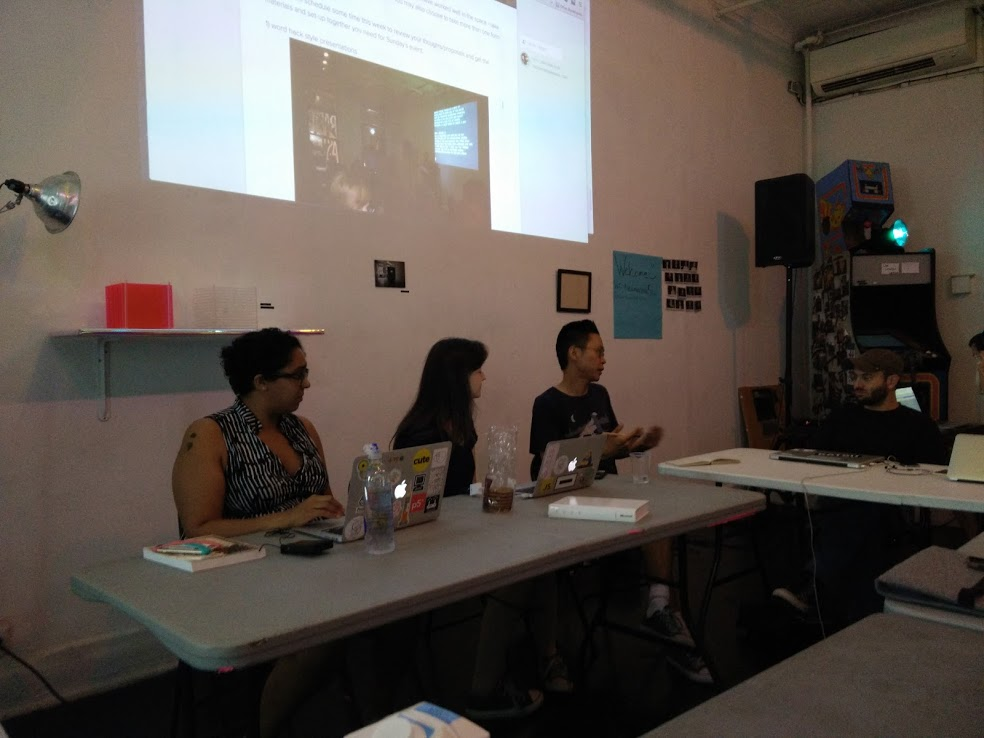
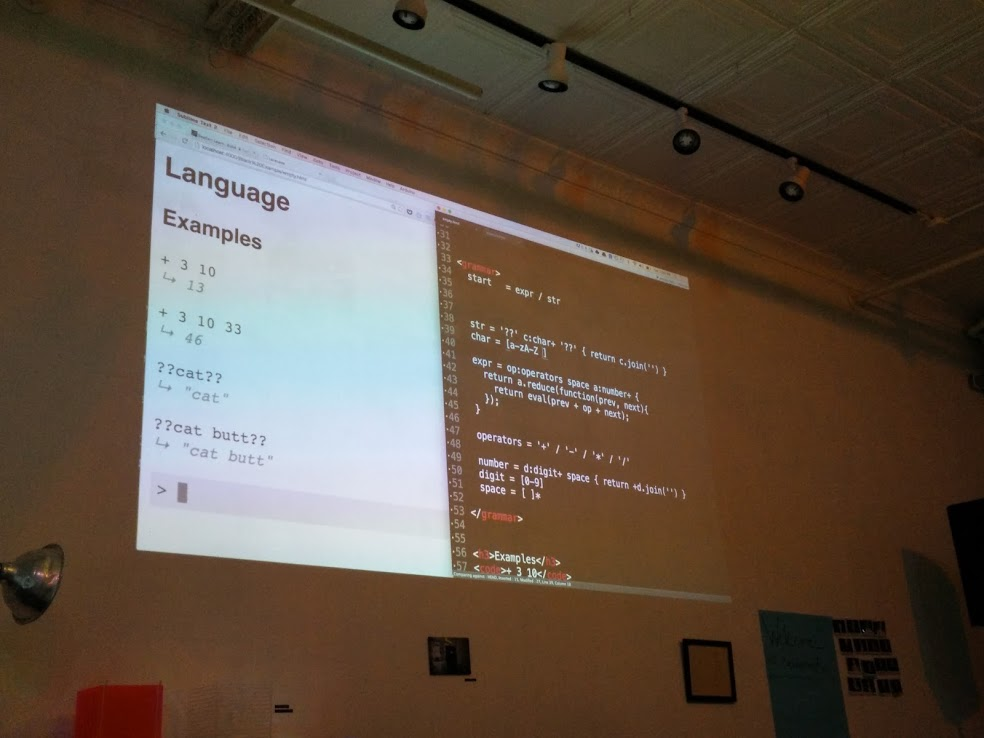
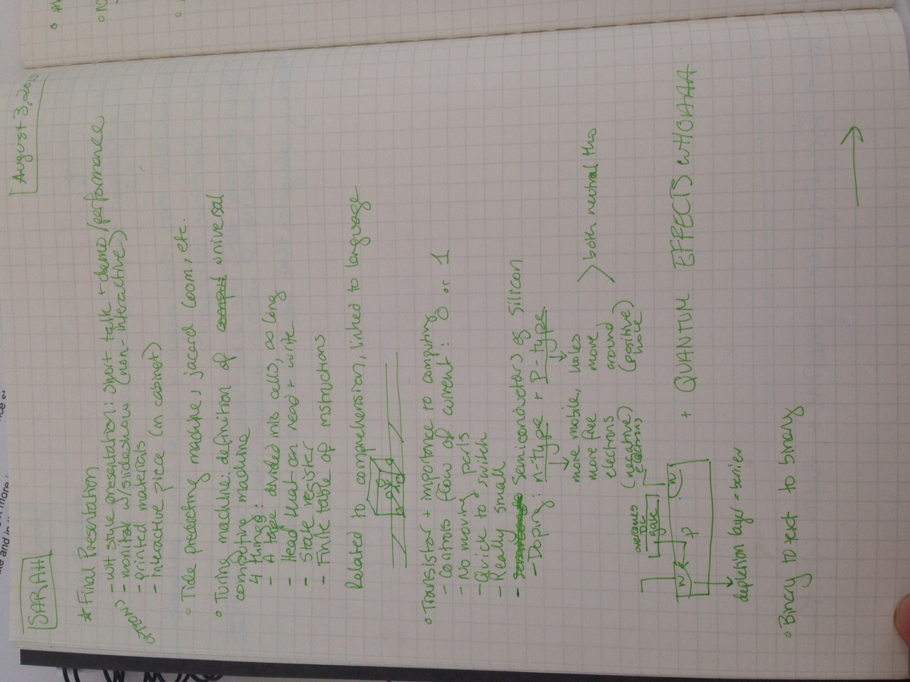
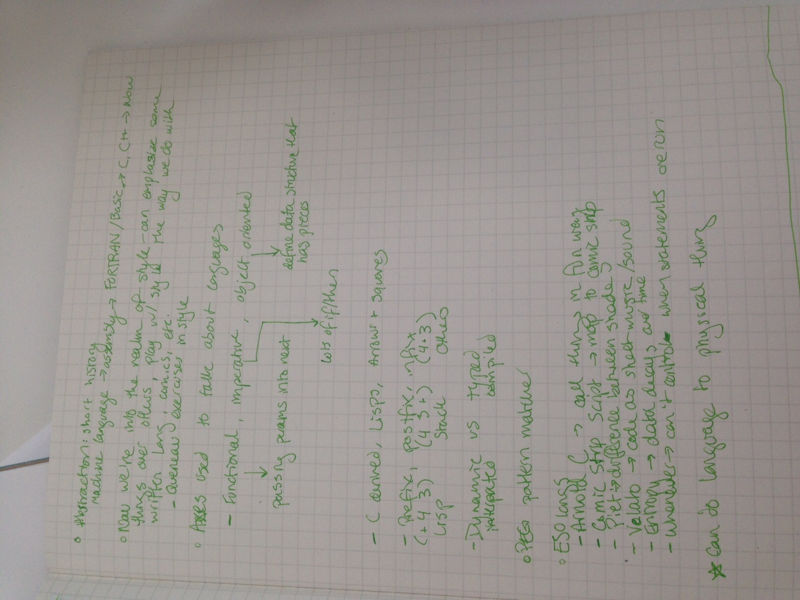

Today was Talking To Machines with [Sarah Groff-Palermo](http://www.sarahgp.com/)! I’ve been programming for quite a while now, but have never made my own programming language before, so I was super-psyched for this class. After all, like we talked about in Nick Montfort’s class, platforms embody ideas about how computation should be used, and shape the kinds of things made with them, so being able to make a language that reflects your view of the world/your workflow/etc. seems like a fantastic skill.

Sarah’s first question for us was: how do computers work? What are they good for? After a few answers from us, she took us through a history of different definitions of computation and key moments in its development. We talked a bit about Turing Machines and learned about transistors and their importance to computing. I’m not a hardware person, so it was really interesting to learn about how semiconductors so revolutionized computing.

We went through a brief history of abstraction, from machine language to assembly to FORTRAN/BASIC to C/C++ through now. That last point brings us to the realm of style, meaning that we can start to develop languages that reflect our view of computing, our preferred way of working, our view of the world, and so on. We went over a few axes used to describe current languages, only some of which I’d heard before, such as:

* Functional/imperative/object oriented
* C derived, Lisps, arrows and squares
* Prefix, postfix, infix
* Dynamic, typed
* Interpreted, compiled

After that, it was onto esolangs! In addition to the above axes, these esolangs played a lot with visual representation and mapping traditional programming functionality onto new terms. We went over [ArnoldC](https://github.com/lhartikk/ArnoldC) (based on the one-liners of Arnold Schwarzenegger), [Piet](http://www.dangermouse.net/esoteric/piet.html) (where programs look like abstract paintings), [Velato](http://esolangs.org/wiki/velato) (which uses midi files as source code), and more.

Sarah introduced us to [PLTJS](https://github.com/nasser/pltjs) and [Ohm](https://github.com/cdglabs/ohm), and the rest of the class was mostly looking through examples and discussing projects we’d like to make. Having coded at work for 8 hours right before this class, it was a little hard to get my brain to parse the grammar of pattern matching for language development, but I’m psyched to come in fresh and hack away at this at the next class!

